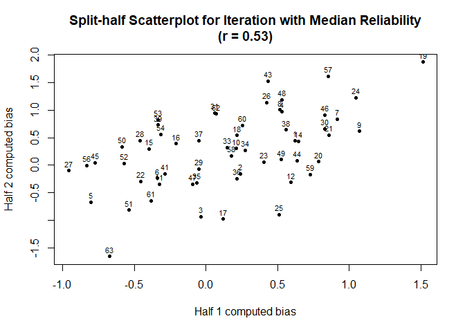
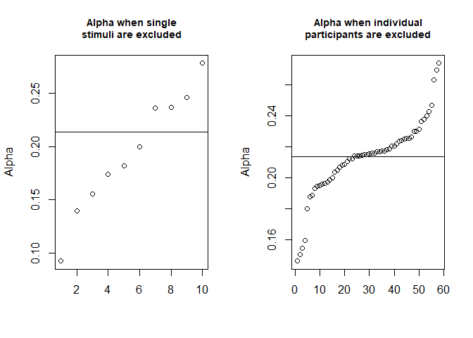
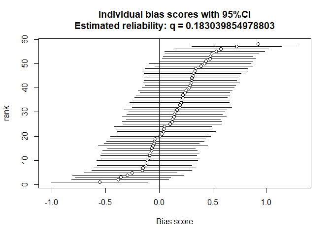
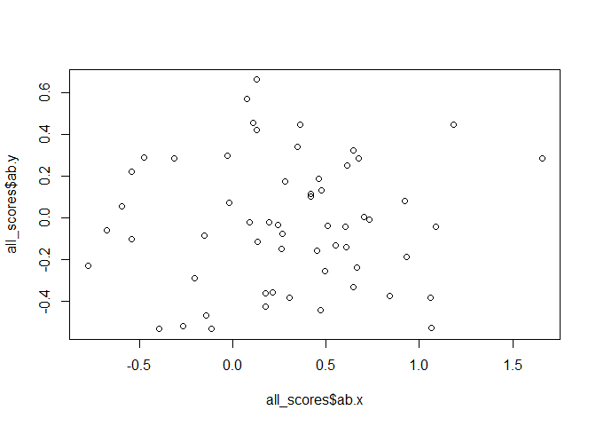

<!-- header -->

# AATtools 

<!-- badges: start -->

[](https://cran.r-project.org/package=AATtools)

[](https://cran.r-project.org/package=AATtools)
[](https://cran.r-project.org/package=AATtools)
<!-- badges: end -->

## Introduction

AATtools provides tools to deal with data from implicit psychological
tasks. It provides methods to compute reliability and aggregate data
into bias scores.

Install it this way:

``` r
install.packages("AATtools")
```

## Rationale

Reliability scores are typically not computed for psychological tasks
that produce scores. This has led to a literature with inconsistent
results and methodological decisions that have been guided by intuition
rather than empirical decisionmaking. AATtools tries to solve these
problems by providing multiple methods of computing the reliability of
the Approach-Avoidance task as well as other implicit psychological
tasks. Importantly, it enables researchers to compute the reliability of
their entire data processing pipeline, factoring in the influence of
decisions to remove or keep outliers in the final reliability score.
This gives the researcher a clear overview over how reliable the data
are that have actually been used in the study’s analyses and enables
them to explore the best ways to deal with non-normality, outliers and
error trials.

## Getting your data in the right format

AATtools works with long-format `data.frames` that follow a specific
format. Your `data.frame` should contain one trial per row, and it
should contain variables that designate the relevant conditions
(approach/avoidance, control/target stimuli). For best results, approach
and approach-associated stimulus categories should be indicated with a 1
while avoidance and avoidance-associated stimulus categories should be
labelled with a 0.

## Computing reliability

If your data is in the right format, you can get started right away. The
`aat_splithalf` function allows you to approximate the reliability of
any kind of summary score and data cleaning pipeline.

``` r
#This is a built-in dataset 
dataset <- erotica[erotica$is_irrelevant==0,] 

split <- 
  aat_splithalf(ds=dataset, #our dataset
                subjvar="subject", #the column designating participant IDs
                pullvar="is_pull", #the column designating approach (1) and avoidance (0) trials
                targetvar="is_target", #the column designating target (1) and control (0) stimulus trials
                rtvar="RT", #the column designating reaction times
                iters=1000, #Set the number of bootstrapping iterations (more is better)
                trialdropfunc="trial_prune_3SD", #Indicate whether outliers should be removed, and if so, how
                casedropfunc="case_prune_3SD", #Indicate whether outlying approach bias scores should be removed
                algorithm="aat_dscore", #The algorithm by which approach bias scores should be computed
                plot=F #Should the results be plotted immediately?
                )
print(split)
```

    ## 
    ## Full-length reliability (Spearman-Brown coefficient):
    ## SB (57.904) = .68, 95%CI [.54, .78], p = 0
    ## 
    ## Uncorrected, average split-half correlation:
    ## r (57.904) = .51, 95%CI [.37, .64], p = 0

``` r
plot(split)
```

<!-- -->

Alternatively, you can use `q_reliability` to compute an exact
reliability score for your data.

## An exact reliability score for all implicit tasks with difference scores: `q_reliability()`

This function computes the reliability of the task in one go and without
performing many splits, saving time.

`q_reliability()` performs a linear regression to the data of each
participant, and derives the unstandardized beta and variance of one of
the predictors. If this predictor is the intercept, the resulting beta
is functionally equivalent to the simple mean reaction time of the
participant; if it is a binary main effect, the beta is equivalent to
the difference between condition 1 and condition 0; and if it’s an
interaction term, the beta is equivalent to a double-difference score.
The variance among betas is then compared to the overall variance within
betas. `q_reliability2()` computes the within- and between-subjects
variance without performing any regressions and is thus faster and more
accurate. It allows for the computation of reliability for single or
double mean difference scores, as well as any difference scores
standardized by the participant’s standard deviation. The reliability
computed by `q_reliability()` and `q_reliability2()` represents the
ratio between between-subjects variance and within-subjects variance,
where 0 means there is equal variance within and between subjects, and 1
means the bias scores are entirely accurate. These functions do not
factor in variability caused by the outlier rejection rules that the
researcher used; therefore, they cannot model the confidence intervals
for the reliability coefficient.

``` r
dataset_relevant <- erotica[erotica$is_irrelevant==0,] 
dataset_irrelevant <- erotica[erotica$is_irrelevant==1,] 

# Reliability of the relevant-feature AAT
qreliability_relevant <- 
  q_reliability(ds=dataset_relevant, #the data
                subjvar="subject", #the name of the column containing participant IDs
                formula=RT~is_pull*is_target, #Here we specify the way bias scores are to be computed (see above)
                aatterm="is_pull:is_target" #The term in the regression formula which represents the bias score
                )
print(qreliability_relevant)
```

    ## q = 0.6676301

``` r
# Reliability of the irrelevant-feature AAT
qreliability_irrelevant <- 
  q_reliability2(ds=dataset_irrelevant,
                subjvar="subject",
                splitvars=c("is_pull","is_target"),
                rtvar="RT"
                )
print(qreliability_irrelevant)
```

    ## q = -0.2478222

## Computing Cronbach’s alpha for your experiment

Cronbach’s alpha is a common, but suboptimal method to compute the
reliability of psychological experiments. In the context of the AAT,
approach bias scores are computed per stimulus for each participant,
after which Cronbach’s alpha is computed by treating each stimulus
approach bias score as a separate item in a questionnaire. This method
does not take into account variability in raw reaction times and is
heavily dependent on the number of stimuli included in the experiment,
rather than the number of trials as a whole. Despite its inaccuracy, it
has been included for the sake of completeness.

``` r
dataset <- erotica
#This dataset is unfortunately not suitable for the application of this method. We artificially make it compatible by pretending there are only 10 stimuli per category rather than 40.
dataset$stimulus<- substr(as.character(dataset$stimulus),5,5)

#We use the special jackknife function, which allows us to diagnose flaws in the experiment by computing Cronbach's alpha while single stimuli or participants are excluded.
alpha<-aat_covreliability_jackknife(ds=dataset, #The dataset
                                    subjvar="subject", #Name of the column with participant IDs
                                    stimvar="stimulus",#Name of the column with stimulus IDs
                                    pullvar="is_pull", #Name of the column indicating approach or avoid trial
                                    rtvar="RT",        #Name of the column indicating reaction time
                                    algorithm="calpha") #Reliability computation method. calpha is Cronbach's alpha
print(alpha)
```

    ## Reliability: r = .21
    ## Maximum achieveable reliability is with removal of participant 56: r = .27
    ## Maximum achieveable reliability is with removal of stimulus 3: r = .28

``` r
plot(alpha)
```

<!-- -->

## Computing confidence intervals for bias scores

The `aat_bootstrap` function can be used to compute bias scores from
random permutations of the data, and derive per-participant confidence
intervals from these bootstrapped bias scores. This lets users quantify
for which participants the bias scores are accurate and for which
participants they are not. This method also allows for the computation
of reliability through bootstrapping.

``` r
dataset <- erotica

boot <- 
  aat_bootstrap(ds=dataset,
                subjvar="subject",
                pullvar="is_pull",
                targetvar="is_target",
                rtvar="RT",
                iters=1000,
                trialdropfunc="trial_prune_3SD",
                algorithm="aat_dscore",
                plot=F
                )
print(boot)
```

    ## Bootstrapped bias scores and confidence intervals
    ## Mean bias score: 0.1398992
    ## Mean confidence interval: 0.8943732
    ## reliability: q = 0.3072345
    ## Number of iterations: 1000

``` r
plot(boot)
```

<!-- -->

## Computing bias scores

The `aat_compute` function can be used to compute bias scores. This can
save a lot of coding time.

``` r
dataset_relevant <- erotica[erotica$is_irrelevant==0,] 
dataset_irrelevant <- erotica[erotica$is_irrelevant==1,] 

relevant_scores <- 
  aat_compute(ds=dataset_relevant, subjvar="subject", pullvar="is_pull", targetvar="is_target", 
              rtvar="RT", trialdropfunc="trial_prune_3SD", algorithm="aat_dscore")
irrelevant_scores <- 
  aat_compute(ds=dataset_irrelevant, subjvar="subject", pullvar="is_pull", targetvar="is_target", 
              rtvar="RT", trialdropfunc="trial_prune_3SD", algorithm="aat_dscore")

all_scores <- merge(relevant_scores,irrelevant_scores, by="subject", all=T)
plot(all_scores$ab.x,all_scores$ab.y)
```

<!-- -->

Evidently, there is no relationship between relevant-feature and
irrelevant-feature bias scores in this dataset.

## Simulating datasets

For the sake of power analysis or methodological research, it may be
desired to generate a random dataset. `aat_simulate()` can be used for
this purpose. A lot of parameters can be adjusted, but one can opt-in to
use default values derived from pre-existing datasets as well.

``` r
ds<-aat_simulate2(defaults="Lender2018_relevant_clean")
par(mfrow=c(1,2))
hist(ds$rt)
q_reliability2(ds=ds,subjvar="subj",splitvars=c("is_pull","is_target"),rtvar="rt",dscore=T)
```

    ## q = 0.8184178

<!-- -->
